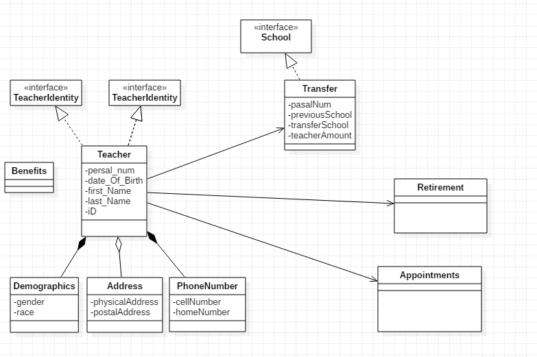

# Assignment-5
# Domain is Education

To be specific what i am trying to achieve is a for HR of the education department.
So what do an HR does, well i did some research, interviewed a professional,
and he mention what he does is the following:

- Hire Teachers
- Transfer Teachers to different schools
- Make Appointments
- and Handle retirement

however i will conduct another interview to get More Information.

At the moment i am creating the program to handle:
- Adding new Teachers to the system, so the Teacher would have to go through the interviews and screening
  and if they are accepted they are then processed into the system 
- creating appointments if they want, incase they have queries and issues with their pay or for some other reason
- Transferring the teachers for reasons between them and the department.
- And also if teachers want to retire they can do so. Benefits will be handled when registering a Teacher in the system.

Domain diagram
